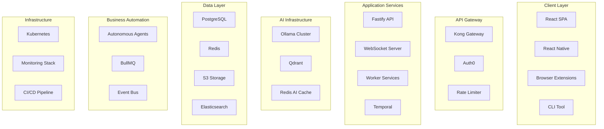

# Fine Print AI - Complete Technology Stack Documentation

## Architecture Overview



## Core Technology Choices

### Frontend Stack

#### Web Application
```yaml
framework: React 18.2
language: TypeScript 5.0
build_tool: Vite 5.0
styling:
  css_framework: Tailwind CSS 3.4
  component_library: Radix UI
  animations: Framer Motion
  icons: Lucide React
state_management:
  global: Zustand 4.4
  server_state: TanStack Query 5.0
  forms: React Hook Form + Zod
testing:
  unit: Vitest
  component: React Testing Library
  e2e: Playwright
dev_tools:
  linting: ESLint + Prettier
  git_hooks: Husky + lint-staged
  component_docs: Storybook 7.0
```

#### Mobile Application
```yaml
framework: React Native 0.73
platform: Expo SDK 50
navigation: React Navigation 6
state: Same as web (Zustand)
ui_components:
  ios: Native iOS components
  android: Material Design 3
offline: WatermelonDB
testing: Jest + Detox
```

#### Browser Extensions
```yaml
framework: Plasmo
manifest: v3 (Chrome/Edge), v2 (Firefox)
ui: React + Tailwind
storage: chrome.storage.sync
communication: Message passing
bundler: Parcel
```

### Backend Stack

#### API Server
```yaml
runtime: Node.js 20 LTS
framework: Fastify 4.25
language: TypeScript 5.0
validation: Zod
documentation: OpenAPI 3.1
authentication: JWT + Refresh tokens
file_handling: Multer
logging: Pino
testing: Jest + Supertest
```

#### Database Layer
```yaml
primary_db:
  engine: PostgreSQL 16
  orm: Prisma 5.7
  migrations: Prisma Migrate
  connection_pool: PgBouncer
  
cache_layer:
  engine: Redis 7.2
  client: ioredis
  use_cases:
    - Session storage
    - API response cache
    - Rate limiting
    - Job queues
    
vector_db:
  engine: Qdrant 1.7
  use_cases:
    - Document embeddings
    - Semantic search
    - Pattern similarity
    
search_engine:
  engine: Elasticsearch 8.11
  use_cases:
    - Full-text search
    - Log aggregation
    - Analytics
```

#### Message Queue & Job Processing
```yaml
queue_system:
  engine: BullMQ
  backend: Redis
  features:
    - Priority queues
    - Delayed jobs
    - Rate limiting
    - Progress tracking
    
workflow_orchestration:
  engine: Temporal
  use_cases:
    - Long-running workflows
    - Retry logic
    - State management
    - Distributed transactions
```

### AI/ML Infrastructure

#### Local LLM Deployment
```yaml
inference_engine: Ollama
models:
  tier_1_fast:
    - phi-2:2.7b
    - tinyllama:1.1b
  tier_2_balanced:
    - mistral:7b
    - neural-chat:7b
  tier_3_advanced:
    - llama2:13b
    - mixtral:8x7b
    
deployment:
  orchestration: Kubernetes
  gpu_support: NVIDIA Container Toolkit
  load_balancing: Round-robin
  auto_scaling: Based on queue depth
```

#### Model Management
```yaml
model_storage: S3 + EFS
versioning: DVC (Data Version Control)
training_pipeline: Kubeflow
monitoring: Prometheus + Grafana
a_b_testing: Feature flags
```

### Infrastructure & DevOps

#### Container Orchestration
```yaml
platform: Kubernetes 1.29
distribution: EKS (AWS) / GKE (Google) / AKS (Azure)
ingress: NGINX Ingress Controller
service_mesh: Istio (optional)
package_manager: Helm 3
gitops: ArgoCD
secrets: Sealed Secrets + External Secrets Operator
```

#### CI/CD Pipeline
```yaml
version_control: GitHub
ci_platform: GitHub Actions
cd_platform: ArgoCD
build_stages:
  - lint: ESLint, Prettier, Stylelint
  - test: Unit, Integration, E2E
  - security: Snyk, OWASP, Trivy
  - build: Docker multi-stage
  - deploy: GitOps with ArgoCD
  
environments:
  - development: Auto-deploy on push
  - staging: Auto-deploy on PR merge
  - production: Manual approval required
```

#### Monitoring & Observability
```yaml
metrics:
  collector: Prometheus
  storage: Prometheus + Thanos
  visualization: Grafana
  
logs:
  collector: Fluent Bit
  storage: Loki
  query: Grafana
  
traces:
  collector: OpenTelemetry
  storage: Jaeger
  visualization: Grafana
  
alerts:
  manager: AlertManager
  channels: Slack, PagerDuty, Email
  
apm:
  platform: DataDog (optional)
  custom_metrics: StatsD
```

### Security Stack

#### Application Security
```yaml
authentication:
  provider: Auth0 / Supabase Auth
  methods:
    - Email/Password
    - OAuth (Google, GitHub)
    - Magic links
    - MFA/2FA
    
authorization:
  model: RBAC + ABAC
  implementation: Casbin
  
api_security:
  rate_limiting: Kong + Redis
  ddos_protection: Cloudflare
  waf: ModSecurity
  cors: Configured per environment
  
secrets_management:
  development: .env files
  production: AWS Secrets Manager / Vault
```

#### Data Security
```yaml
encryption:
  at_rest: AES-256-GCM
  in_transit: TLS 1.3
  key_management: AWS KMS / HashiCorp Vault
  
pii_handling:
  detection: Presidio
  masking: Custom middleware
  retention: Automated cleanup
  
compliance:
  gdpr: Data export/deletion APIs
  ccpa: Opt-out mechanisms
  sox: Audit logging
  hipaa: Future consideration
```

### Third-Party Integrations

#### Analytics & Marketing
```yaml
product_analytics:
  primary: Mixpanel / Amplitude
  secondary: Google Analytics 4
  privacy_focused: Plausible
  
email:
  transactional: SendGrid / Postmark
  marketing: ConvertKit / Mailchimp
  
customer_support:
  chat: Intercom / Crisp
  ticketing: Linear / Freshdesk
  knowledge_base: Docusaurus
```

#### Payment & Billing
```yaml
payment_processor: Stripe
features:
  - Subscriptions (SaaS model)
  - Usage-based billing
  - Multi-currency
  - Tax calculation (Stripe Tax)
  - Invoicing
  - Payment methods (cards, ACH, SEPA)
  
revenue_ops:
  analytics: Stripe Sigma
  dunning: Stripe Billing
  fraud: Stripe Radar
```

#### Developer Tools
```yaml
api_documentation:
  spec: OpenAPI 3.1
  ui: Swagger UI / Redoc
  sdk_generation: OpenAPI Generator
  
error_tracking:
  frontend: Sentry
  backend: Sentry
  source_maps: Uploaded on deploy
  
feature_flags:
  platform: LaunchDarkly / Unleash
  sdk: React, Node.js
  
performance:
  monitoring: New Relic / DataDog
  profiling: Chrome DevTools
  load_testing: k6 / Artillery
```

## Development Environment

### Local Development Setup
```yaml
containerization:
  platform: Docker Desktop
  orchestration: Docker Compose
  
services:
  - app: Hot reload enabled
  - api: Nodemon watching
  - db: PostgreSQL 16
  - cache: Redis 7
  - ollama: CPU mode for dev
  - email: MailHog
  
tools:
  ide: VS Code with extensions
  db_client: TablePlus / DBeaver
  api_client: Insomnia / Postman
  git_client: GitKraken / Fork
```

### Development Workflow
```bash
# Initial setup
git clone https://github.com/company/fineprintai
cd fineprintai
cp .env.example .env
docker-compose up -d

# Frontend development
cd apps/web
npm install
npm run dev

# Backend development
cd apps/api
npm install
npm run dev

# Run tests
npm run test
npm run test:e2e

# Build for production
npm run build
docker build -t fineprintai .
```

## Technology Decision Rationale

### Why This Stack?

#### Frontend Choices
- **React**: Mature ecosystem, large talent pool
- **TypeScript**: Type safety, better DX, fewer bugs
- **Tailwind**: Rapid development, consistent design
- **Vite**: Fast builds, great DX
- **Zustand**: Simple state management, TypeScript-first

#### Backend Choices
- **Node.js**: JavaScript everywhere, huge ecosystem
- **Fastify**: High performance, schema validation
- **PostgreSQL**: ACID compliance, JSON support
- **Redis**: Fast caching, pub/sub capabilities
- **Temporal**: Reliable workflow orchestration

#### AI/ML Choices
- **Ollama**: Local deployment, privacy, cost savings
- **Multiple models**: Right tool for right job
- **Qdrant**: Purpose-built for embeddings
- **Local-first**: Data privacy, GDPR compliance

#### Infrastructure Choices
- **Kubernetes**: Industry standard, scalability
- **GitHub Actions**: Integrated with repo
- **Prometheus/Grafana**: Open source, powerful
- **ArgoCD**: GitOps best practices

## Scalability Architecture

### Horizontal Scaling Strategy
```yaml
web_tier:
  min_replicas: 3
  max_replicas: 50
  scaling_metric: CPU > 70%
  
api_tier:
  min_replicas: 5
  max_replicas: 100
  scaling_metric: Request latency > 500ms
  
worker_tier:
  min_replicas: 10
  max_replicas: 200
  scaling_metric: Queue depth > 100
  
ai_tier:
  min_replicas: 2 per model
  max_replicas: 10 per model
  scaling_metric: GPU utilization > 80%
```

### Database Scaling
```yaml
postgresql:
  primary: 1x r6g.2xlarge
  read_replicas: 3x r6g.xlarge
  connection_pooling: PgBouncer
  partitioning: By tenant_id and date
  
redis:
  cluster_mode: Enabled
  shards: 3
  replicas_per_shard: 2
  
elasticsearch:
  master_nodes: 3
  data_nodes: 5
  heap_size: 4GB per node
```

## Cost Optimization

### Infrastructure Costs (Monthly)
```yaml
development:
  total: ~$500
  breakdown:
    - Kubernetes: $200 (small cluster)
    - Database: $100 (small RDS)
    - Storage: $50 (S3 + backups)
    - CDN: $50 (CloudFront)
    - Monitoring: $100 (DataDog)
    
production:
  total: ~$5,000
  breakdown:
    - Kubernetes: $2,000 (auto-scaling cluster)
    - Database: $1,000 (HA setup)
    - GPU instances: $1,000 (for Ollama)
    - Storage: $300 (S3 + backups)
    - CDN: $200 (CloudFront)
    - Monitoring: $500 (Full APM)
    
optimization_strategies:
  - Spot instances for workers
  - Reserved instances for stable workloads
  - Aggressive caching
  - CDN for static assets
  - Serverless for sporadic tasks
```

## Security Considerations

### Security Layers
1. **Network Security**
   - VPC with private subnets
   - Security groups with least privilege
   - WAF rules for common attacks
   - DDoS protection

2. **Application Security**
   - Input validation at every layer
   - SQL injection prevention (Prisma)
   - XSS protection (React)
   - CSRF tokens
   - Security headers

3. **Data Security**
   - Encryption everywhere
   - No document storage
   - PII detection and masking
   - Audit logs for compliance

4. **Infrastructure Security**
   - Principle of least privilege
   - Regular security updates
   - Vulnerability scanning
   - Penetration testing

## Disaster Recovery

### Backup Strategy
```yaml
database:
  frequency: Every 6 hours
  retention: 30 days
  type: Automated snapshots
  testing: Weekly restore test
  
code:
  primary: GitHub
  mirror: GitLab
  artifacts: S3 versioning
  
configuration:
  secrets: Versioned in Vault
  infrastructure: Terraform state in S3
  
documents:
  policy: No storage, only metadata
  user_data: Exportable on demand
```

### Recovery Objectives
```yaml
rto: 4 hours  # Recovery Time Objective
rpo: 1 hour   # Recovery Point Objective
availability: 99.9% uptime
regions: Multi-region active-passive
failover: Automated with health checks
```

## Future Technology Considerations

### Potential Additions
1. **GraphQL**: For flexible API queries
2. **WebAssembly**: For client-side document processing
3. **Edge Computing**: CloudFlare Workers for global latency
4. **Blockchain**: For tamper-proof audit logs
5. **WebRTC**: For real-time collaboration features

### Upgrade Path
- **React 19**: When stable
- **Node.js 22**: When LTS
- **PostgreSQL 17**: For better performance
- **Kubernetes 1.30+**: For new features
- **TypeScript 6**: When released

## Development Team Requirements

### Core Team Skills
1. **Frontend**: React, TypeScript, Tailwind
2. **Backend**: Node.js, PostgreSQL, REST/GraphQL
3. **DevOps**: Kubernetes, CI/CD, Monitoring
4. **AI/ML**: Python, LLM deployment, Fine-tuning
5. **Security**: Application security, Compliance

### Team Structure
```yaml
engineering:
  frontend: 2-3 developers
  backend: 2-3 developers
  devops: 1-2 engineers
  ai_ml: 1-2 engineers
  qa: 1-2 engineers
  
product:
  product_manager: 1
  designer: 1
  technical_writer: 1
  
total_initial_team: 10-15 people
```

This technology stack provides a solid foundation for building a scalable, secure, and cost-effective Fine Print AI platform while maintaining flexibility for future growth and technological advances.