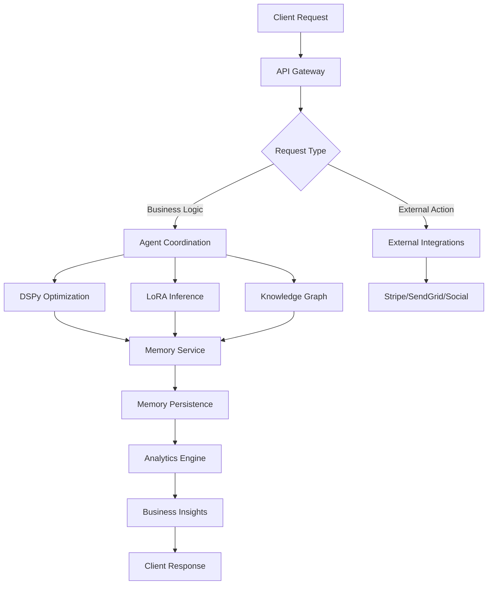

# Fine Print AI - Autonomous AI System Integration & Deployment Guide

## Executive Summary

This document provides comprehensive documentation for the Fine Print AI autonomous business operations system, featuring real AI agent capabilities with DSPy prompt optimization, LoRA fine-tuning, and Neo4j knowledge graphs. The system enables true autonomous business operations across marketing, sales, customer support, and legal document analysis.

## Table of Contents

1. [System Architecture Overview](#system-architecture-overview)
2. [Core Services](#core-services)
3. [AI & Machine Learning Components](#ai-machine-learning-components)
4. [Business Intelligence & Analytics](#business-intelligence-analytics)
5. [Integration Patterns](#integration-patterns)
6. [Deployment Architecture](#deployment-architecture)
7. [Performance & Scaling](#performance-scaling)
8. [Security & Compliance](#security-compliance)
9. [Monitoring & Operations](#monitoring-operations)
10. [Disaster Recovery](#disaster-recovery)

## System Architecture Overview

### High-Level Architecture

```
┌─────────────────────────────────────────────────────────────────────────┐
│                        Fine Print AI Platform                              │
├─────────────────────────────────────────────────────────────────────────┤
│                         Frontend Applications                              │
│  ┌─────────────┐  ┌─────────────┐  ┌─────────────┐  ┌─────────────┐    │
│  │   Web App   │  │ Mobile App  │  │   Browser   │  │     API     │    │
│  │   (React)   │  │(React Native)│ │  Extension  │  │   Clients   │    │
│  └─────────────┘  └─────────────┘  └─────────────┘  └─────────────┘    │
├─────────────────────────────────────────────────────────────────────────┤
│                          API Gateway (Kong)                                │
├─────────────────────────────────────────────────────────────────────────┤
│                      Autonomous AI Services Layer                          │
│  ┌─────────────┐  ┌─────────────┐  ┌─────────────┐  ┌─────────────┐    │
│  │    Agent    │  │    DSPy     │  │    LoRA     │  │  Knowledge  │    │
│  │Coordination │  │Optimization │  │   Service   │  │    Graph    │    │
│  └─────────────┘  └─────────────┘  └─────────────┘  └─────────────┘    │
├─────────────────────────────────────────────────────────────────────────┤
│                         Core Business Services                             │
│  ┌─────────────┐  ┌─────────────┐  ┌─────────────┐  ┌─────────────┐    │
│  │  Marketing  │  │    Sales    │  │   Support   │  │    Legal    │    │
│  │ Automation  │  │  Pipeline   │  │ Automation  │  │  Analysis   │    │
│  └─────────────┘  └─────────────┘  └─────────────┘  └─────────────┘    │
├─────────────────────────────────────────────────────────────────────────┤
│                           Shared Services                                  │
│  ┌─────────────┐  ┌─────────────┐  ┌─────────────┐  ┌─────────────┐    │
│  │   Config    │  │   Memory    │  │   Logger    │  │    Auth     │    │
│  │  Service    │  │  Service    │  │  Service    │  │  Service    │    │
│  └─────────────┘  └─────────────┘  └─────────────┘  └─────────────┘    │
├─────────────────────────────────────────────────────────────────────────┤
│                          External Integrations                             │
│  ┌─────────────┐  ┌─────────────┐  ┌─────────────┐  ┌─────────────┐    │
│  │   Stripe    │  │  SendGrid   │  │   Social    │  │   Webhook   │    │
│  │  Payments   │  │    Email    │  │   Media     │  │  Processor  │    │
│  └─────────────┘  └─────────────┘  └─────────────┘  └─────────────┘    │
├─────────────────────────────────────────────────────────────────────────┤
│                         Data & Storage Layer                               │
│  ┌─────────────┐  ┌─────────────┐  ┌─────────────┐  ┌─────────────┐    │
│  │ PostgreSQL  │  │    Redis    │  │   Neo4j     │  │     S3      │    │
│  │  (Primary)  │  │   (Cache)   │  │   (Graph)   │  │  (Storage)  │    │
│  └─────────────┘  └─────────────┘  └─────────────┘  └─────────────┘    │
└─────────────────────────────────────────────────────────────────────────┘
```

### Service Communication Flow



## Core Services

### 1. Config Service

**Purpose**: Dynamic configuration management with feature flags

**Key Features**:
- Real-time configuration updates via WebSocket
- Environment-specific overrides
- Feature flag management with A/B testing
- Schema validation for configurations
- Encrypted storage for sensitive values

**API Endpoints**:
```
GET    /api/config/:key
POST   /api/config
GET    /api/features/:flag
POST   /api/features/:flag
GET    /api/config/export
POST   /api/config/import
```

**Integration Example**:
```typescript
// Get configuration
const timeout = await configService.get('api.timeout', 5000);

// Check feature flag with context
const enabled = await configService.isFeatureEnabled('newUI', userId, {
  plan: 'enterprise',
  region: 'us-west',
});

// Watch for changes
configService.watch('api.*', (key, value) => {
  console.log(`Config changed: ${key} = ${value}`);
});
```

### 2. Memory Service

**Purpose**: Multi-tier memory management for AI agents

**Architecture**:
```
┌─────────────────────────────────────────┐
│           Memory Service API             │
├─────────────────────────────────────────┤
│         Memory Type Manager              │
│  ┌──────┐ ┌──────┐ ┌──────┐ ┌──────┐  │
│  │Working│ │Short │ │Long  │ │Semantic│ │
│  │Memory │ │Term  │ │Term  │ │Memory │  │
│  └──────┘ └──────┘ └──────┘ └──────┘  │
├─────────────────────────────────────────┤
│         Storage Tier Manager             │
│  ┌──────┐ ┌──────┐ ┌──────┐           │
│  │ Hot  │ │ Warm │ │ Cold │           │
│  │Redis │ │ PG   │ │  S3  │           │
│  └──────┘ └──────┘ └──────┘           │
└─────────────────────────────────────────┘
```

**Memory Types**:
- **Working Memory**: Current task context (TTL: 5-30 minutes)
- **Short-term Memory**: Recent interactions (TTL: 1-7 days)
- **Long-term Memory**: Important patterns (TTL: 30+ days)
- **Episodic Memory**: Specific events and outcomes
- **Semantic Memory**: Concepts and relationships
- **Procedural Memory**: How-to knowledge
- **Shared Memory**: Cross-agent knowledge

**Storage Tiers**:
- **Hot (Redis)**: < 7 days, frequently accessed
- **Warm (PostgreSQL)**: 7-30 days, moderate access
- **Cold (S3)**: > 30 days, archival

### 3. Logger Service

**Purpose**: Structured logging with correlation tracking

**Features**:
- Correlation ID tracking across services
- Structured JSON logging
- Log aggregation and search
- Performance metrics capture
- Error tracking and alerting

**Usage**:
```typescript
const logger = createServiceLogger('my-service');

logger.info('Processing request', {
  correlationId: req.correlationId,
  userId: req.user.id,
  action: 'document_analysis',
  metadata: { documentType: 'tos', size: 50000 }
});
```

### 4. Auth Service

**Purpose**: Unified authentication and authorization

**Features**:
- JWT-based authentication
- Role-based access control (RBAC)
- API key management
- OAuth2 integration
- Service-to-service authentication

## AI & Machine Learning Components

### 1. DSPy Service

**Purpose**: Systematic prompt optimization using DSPy framework

**Architecture**:
```
┌─────────────────────────────────────────┐
│            DSPy Service                  │
├─────────────────────────────────────────┤
│       Optimization Engine                │
│  ┌──────────┐  ┌──────────┐            │
│  │ Bootstrap │  │ Compiler │            │
│  │ Few-Shot │  │   Chain  │            │
│  └──────────┘  └──────────┘            │
├─────────────────────────────────────────┤
│      Business Context Integration        │
│  ┌──────────┐  ┌──────────┐            │
│  │Marketing │  │  Sales   │            │
│  │ Context  │  │ Context  │            │
│  └──────────┘  └──────────┘            │
├─────────────────────────────────────────┤
│        Learning Service                  │
│  ┌──────────┐  ┌──────────┐            │
│  │ Pattern  │  │ Success  │            │
│  │Detection │  │ Tracking │            │
│  └──────────┘  └──────────┘            │
└─────────────────────────────────────────┘
```

**Key Capabilities**:
- Automatic prompt optimization based on examples
- Chain-of-thought optimization
- Business metric-driven optimization
- A/B testing of prompts
- Continuous learning from outcomes

**Optimization Flow**:
```typescript
// 1. Define optimization task
const optimization = await dspyService.optimize({
  taskId: 'marketing_email_v2',
  domain: 'marketing',
  examples: [
    {
      input: { product: 'Fine Print AI', audience: 'lawyers' },
      output: 'Subject: Cut contract review time by 80%...',
      metadata: { openRate: 0.32, clickRate: 0.15 }
    }
  ],
  initialPrompt: 'Write email for {product} to {audience}',
  optimizationConfig: {
    iterations: 10,
    evaluationMetrics: ['openRate', 'clickRate']
  }
});

// 2. Use optimized prompt
const result = await dspyService.generate({
  taskId: 'marketing_email_v2',
  input: { product: 'New Feature', audience: 'CTOs' }
});
```

### 2. LoRA Service

**Purpose**: Parameter-efficient fine-tuning with LoRA adapters

**Architecture**:
```
┌─────────────────────────────────────────┐
│            LoRA Service                  │
├─────────────────────────────────────────┤
│         Training Pipeline                │
│  ┌──────────┐  ┌──────────┐            │
│  │   Data   │  │ Unsloth  │            │
│  │Processor │  │ Trainer  │            │
│  └──────────┘  └──────────┘            │
├─────────────────────────────────────────┤
│      Multi-Model Manager                 │
│  ┌──────────┐  ┌──────────┐            │
│  │  Model   │  │    A/B   │            │
│  │Registry  │  │  Testing │            │
│  └──────────┘  └──────────┘            │
├─────────────────────────────────────────┤
│     Continuous Learning                  │
│  ┌──────────┐  ┌──────────┐            │
│  │ Feedback │  │   Drift  │            │
│  │Collection│  │Detection │            │
│  └──────────┘  └──────────┘            │
└─────────────────────────────────────────┘
```

**Supported Base Models**:
- Phi-2 (2.7B) - Fast inference, good for real-time
- Mistral (7B) - Balanced performance
- Llama2 (13B) - High quality outputs
- Mixtral (8x7B) - Best quality, slower

**Training Configuration**:
```python
# LoRA configuration
config = LoraConfig(
    r=16,               # Rank
    lora_alpha=32,      # Alpha parameter
    target_modules=[    # Modules to adapt
        "q_proj",
        "v_proj",
        "k_proj",
        "o_proj"
    ],
    lora_dropout=0.05,
    bias="none",
    task_type="CAUSAL_LM"
)

# Training arguments
training_args = TrainingArguments(
    per_device_train_batch_size=4,
    gradient_accumulation_steps=4,
    num_train_epochs=3,
    learning_rate=2e-4,
    fp16=True,
    save_strategy="epoch",
    evaluation_strategy="epoch",
    logging_steps=10,
    warmup_ratio=0.1,
    optim="adamw_torch",
    report_to=["tensorboard"]
)
```

### 3. Knowledge Graph Service

**Purpose**: Business intelligence through graph relationships

**Neo4j Schema**:
```cypher
// Customer relationships
(c:Customer {
  id: string,
  name: string,
  industry: string,
  mrr: number,
  created: datetime
})

// Product subscriptions
(c:Customer)-[:SUBSCRIBED_TO {
  startDate: datetime,
  seats: number,
  monthlyValue: number
}]->(p:Product)

// Sales interactions
(c:Customer)-[:HAD_INTERACTION {
  type: string,
  outcome: string,
  timestamp: datetime
}]->(i:Interaction)

// Support tickets
(c:Customer)-[:CREATED]->(t:Ticket)-[:RESOLVED_BY]->(a:Agent)

// Marketing campaigns
(c:Customer)-[:ENGAGED_WITH {
  clickRate: float,
  conversion: boolean
}]->(m:Campaign)
```

**Business Intelligence Queries**:
```cypher
// Customer journey analysis
MATCH path = (c:Customer)-[*1..10]->(outcome:Purchase)
WHERE c.id = $customerId
RETURN path, length(path) as steps

// Churn prediction patterns
MATCH (c:Customer)-[r:HAD_INTERACTION]->(i:Interaction)
WHERE i.timestamp > datetime() - duration('P90D')
WITH c, count(i) as interactions, 
     avg(r.sentiment) as avgSentiment
WHERE interactions < 3 AND avgSentiment < 0.5
RETURN c as atRiskCustomer

// Revenue expansion opportunities
MATCH (c:Customer)-[:SUBSCRIBED_TO]->(p:Product)
WHERE c.usage > 0.8 AND p.tier < 'enterprise'
RETURN c, p, c.mrr * 2 as potentialRevenue
```

### 4. Agent Coordination Service

**Purpose**: Orchestrate multiple AI agents for complex workflows

**Agent Types**:
- **Marketing Agents**: Content creation, campaign management
- **Sales Agents**: Lead qualification, outreach, negotiation
- **Support Agents**: Ticket resolution, knowledge base
- **Legal Agents**: Document analysis, risk assessment

**Coordination Patterns**:
```typescript
// Sequential coordination
const workflow = await coordinator.createWorkflow({
  type: 'sequential',
  steps: [
    { agent: 'lead_qualifier', action: 'assess_lead' },
    { agent: 'sales_specialist', action: 'personalize_outreach' },
    { agent: 'email_composer', action: 'draft_email' }
  ]
});

// Parallel coordination
const results = await coordinator.executeParallel([
  { agent: 'content_creator', task: 'blog_post' },
  { agent: 'social_media', task: 'social_posts' },
  { agent: 'email_designer', task: 'newsletter' }
]);

// Conditional coordination
const decision = await coordinator.makeDecision({
  context: leadData,
  agents: ['sales_strategist', 'pricing_expert'],
  criteria: 'maximize_conversion_probability'
});
```

## Business Intelligence & Analytics

### Memory Persistence Service

**Purpose**: Long-term storage and analysis of agent memories

**Analytics Capabilities**:
1. **Customer Journey Tracking**
   - Touchpoint analysis
   - Conversion path optimization
   - Drop-off point identification

2. **Predictive Analytics**
   - Churn prediction
   - Revenue forecasting
   - Lead scoring

3. **Pattern Recognition**
   - Success patterns by industry
   - Optimal engagement sequences
   - Risk indicators

**Dashboard Metrics**:
```typescript
interface BusinessMetrics {
  revenue: {
    current: number;
    projected: number;
    growth: number;
  };
  customers: {
    total: number;
    active: number;
    atRisk: number;
    churnRate: number;
  };
  aiPerformance: {
    accuracy: number;
    responseTime: number;
    satisfactionScore: number;
  };
  operations: {
    ticketsResolved: number;
    campaignsRunning: number;
    dealsInPipeline: number;
  };
}
```

## Integration Patterns

### 1. Event-Driven Architecture

```typescript
// Event publishing
eventBus.publish('customer.converted', {
  customerId: 'cust_123',
  dealValue: 50000,
  agent: 'sales_ai_007',
  timestamp: new Date()
});

// Event subscription
eventBus.subscribe('customer.converted', async (event) => {
  // Update knowledge graph
  await knowledgeGraph.recordConversion(event);
  
  // Train success patterns
  await loraService.addTrainingExample(event);
  
  // Update agent performance
  await agentCoordination.updateMetrics(event.agent, event);
});
```

### 2. Service Mesh Communication

```yaml
# Istio service configuration
apiVersion: networking.istio.io/v1beta1
kind: VirtualService
metadata:
  name: lora-service
spec:
  hosts:
  - lora-service
  http:
  - match:
    - headers:
        x-version:
          exact: v2
    route:
    - destination:
        host: lora-service
        subset: v2
      weight: 20  # A/B testing
  - route:
    - destination:
        host: lora-service
        subset: v1
      weight: 80
```

### 3. Webhook Processing

```typescript
// Webhook handler with retry logic
class WebhookProcessor {
  async processWebhook(
    source: string,
    headers: Record<string, string>,
    body: any,
    rawBody?: Buffer
  ): Promise<void> {
    // Verify signature
    if (!this.verifySignature(source, headers, rawBody)) {
      throw new Error('Invalid webhook signature');
    }

    // Store event
    const event = await this.storeEvent(source, body);

    // Process with retry
    await this.processWithRetry(event, {
      maxAttempts: 3,
      backoff: 'exponential'
    });
  }
}
```

## Deployment Architecture

### Kubernetes Configuration

```yaml
# Deployment example for LoRA service
apiVersion: apps/v1
kind: Deployment
metadata:
  name: lora-service
  namespace: fineprintai
spec:
  replicas: 3
  selector:
    matchLabels:
      app: lora-service
  template:
    metadata:
      labels:
        app: lora-service
    spec:
      containers:
      - name: lora-service
        image: fineprintai/lora-service:v1.0.0
        ports:
        - containerPort: 8006
        env:
        - name: NODE_ENV
          value: "production"
        - name: REDIS_URL
          valueFrom:
            secretKeyRef:
              name: redis-credentials
              key: url
        resources:
          requests:
            memory: "2Gi"
            cpu: "1000m"
            nvidia.com/gpu: 1  # GPU for inference
          limits:
            memory: "4Gi"
            cpu: "2000m"
            nvidia.com/gpu: 1
        livenessProbe:
          httpGet:
            path: /health
            port: 8006
          initialDelaySeconds: 30
          periodSeconds: 10
        readinessProbe:
          httpGet:
            path: /ready
            port: 8006
          initialDelaySeconds: 5
          periodSeconds: 5
```

### Helm Chart Structure

```
fineprintai-chart/
├── Chart.yaml
├── values.yaml
├── templates/
│   ├── configmap.yaml
│   ├── deployment.yaml
│   ├── service.yaml
│   ├── ingress.yaml
│   ├── hpa.yaml
│   └── servicemonitor.yaml
└── charts/
    ├── postgresql/
    ├── redis/
    ├── neo4j/
    └── kong/
```

### CI/CD Pipeline

```yaml
# GitHub Actions deployment pipeline
name: Deploy to Production

on:
  push:
    branches: [main]

jobs:
  test:
    runs-on: ubuntu-latest
    steps:
    - uses: actions/checkout@v3
    - name: Run tests
      run: |
        npm test
        npm run test:integration
        npm run test:e2e

  build:
    needs: test
    runs-on: ubuntu-latest
    steps:
    - name: Build and push Docker images
      run: |
        docker build -t fineprintai/$SERVICE:$VERSION .
        docker push fineprintai/$SERVICE:$VERSION

  deploy:
    needs: build
    runs-on: ubuntu-latest
    steps:
    - name: Deploy to Kubernetes
      run: |
        helm upgrade --install fineprintai ./helm/fineprintai-chart \
          --namespace production \
          --set image.tag=$VERSION \
          --wait
```

## Performance & Scaling

### Horizontal Pod Autoscaling

```yaml
apiVersion: autoscaling/v2
kind: HorizontalPodAutoscaler
metadata:
  name: lora-service-hpa
spec:
  scaleTargetRef:
    apiVersion: apps/v1
    kind: Deployment
    name: lora-service
  minReplicas: 2
  maxReplicas: 10
  metrics:
  - type: Resource
    resource:
      name: cpu
      target:
        type: Utilization
        averageUtilization: 70
  - type: Resource
    resource:
      name: memory
      target:
        type: Utilization
        averageUtilization: 80
  - type: Pods
    pods:
      metric:
        name: inference_queue_depth
      target:
        type: AverageValue
        averageValue: "5"
```

### Caching Strategy

```typescript
// Multi-level caching
class CacheManager {
  private l1Cache: Map<string, any>; // In-memory
  private l2Cache: Redis;            // Redis
  private l3Cache: CDN;              // CloudFront

  async get(key: string): Promise<any> {
    // L1 - Memory
    if (this.l1Cache.has(key)) {
      return this.l1Cache.get(key);
    }

    // L2 - Redis
    const redisValue = await this.l2Cache.get(key);
    if (redisValue) {
      this.l1Cache.set(key, redisValue);
      return redisValue;
    }

    // L3 - CDN
    const cdnValue = await this.l3Cache.get(key);
    if (cdnValue) {
      await this.l2Cache.setex(key, 3600, cdnValue);
      this.l1Cache.set(key, cdnValue);
      return cdnValue;
    }

    return null;
  }
}
```

### Database Optimization

```sql
-- Partitioned tables for time-series data
CREATE TABLE memories (
    id UUID PRIMARY KEY,
    agent_id VARCHAR(255),
    created_at TIMESTAMP,
    content JSONB,
    embedding vector(1536)
) PARTITION BY RANGE (created_at);

-- Create monthly partitions
CREATE TABLE memories_2024_01 PARTITION OF memories
    FOR VALUES FROM ('2024-01-01') TO ('2024-02-01');

-- Indexes for common queries
CREATE INDEX idx_memories_agent_created ON memories(agent_id, created_at DESC);
CREATE INDEX idx_memories_embedding ON memories USING ivfflat (embedding vector_cosine_ops);
```

## Security & Compliance

### Security Architecture

```
┌─────────────────────────────────────────┐
│          Security Layers                 │
├─────────────────────────────────────────┤
│         WAF (ModSecurity)                │
├─────────────────────────────────────────┤
│      API Gateway (Kong)                  │
│   - Rate limiting                        │
│   - API key validation                   │
│   - JWT verification                     │
├─────────────────────────────────────────┤
│     Service Mesh (Istio)                 │
│   - mTLS between services                │
│   - Network policies                     │
│   - Traffic encryption                   │
├─────────────────────────────────────────┤
│    Application Security                  │
│   - Input validation                     │
│   - Output encoding                      │
│   - CSRF protection                      │
├─────────────────────────────────────────┤
│      Data Security                       │
│   - Encryption at rest                   │
│   - Encryption in transit                │
│   - Key rotation                         │
└─────────────────────────────────────────┘
```

### Compliance Features

**GDPR Compliance**:
```typescript
// Data deletion
async function deleteUserData(userId: string): Promise<void> {
  // Delete from all services
  await Promise.all([
    memoryService.deleteUserMemories(userId),
    knowledgeGraph.deleteUserNodes(userId),
    loraService.deleteUserTrainingData(userId),
    externalIntegrations.deleteUserData(userId)
  ]);

  // Audit log
  await auditLog.record({
    action: 'user_data_deletion',
    userId,
    timestamp: new Date(),
    reason: 'gdpr_request'
  });
}

// Data export
async function exportUserData(userId: string): Promise<UserDataExport> {
  const data = await Promise.all([
    memoryService.exportUserMemories(userId),
    knowledgeGraph.exportUserGraph(userId),
    analyticsService.exportUserAnalytics(userId)
  ]);

  return {
    format: 'json',
    data: mergeExports(data),
    generated: new Date()
  };
}
```

**SOC2 Controls**:
- Access logging and monitoring
- Change management procedures
- Incident response automation
- Regular security assessments

## Monitoring & Operations

### Observability Stack

```yaml
# Prometheus configuration
global:
  scrape_interval: 15s
  evaluation_interval: 15s

scrape_configs:
  - job_name: 'fineprintai-services'
    kubernetes_sd_configs:
    - role: pod
    relabel_configs:
    - source_labels: [__meta_kubernetes_pod_label_app]
      action: keep
      regex: fineprintai-.*
    - source_labels: [__meta_kubernetes_pod_annotation_prometheus_io_port]
      action: replace
      target_label: __address__
      regex: ([^:]+)(?::\d+)?;(\d+)
      replacement: $1:$2
```

### Key Metrics

```typescript
// Business metrics
const businessMetrics = {
  // Revenue metrics
  mrr: new Gauge({
    name: 'business_mrr',
    help: 'Monthly recurring revenue',
    labelNames: ['plan', 'region']
  }),
  
  // AI performance metrics
  inferenceLatency: new Histogram({
    name: 'ai_inference_duration_seconds',
    help: 'AI model inference latency',
    labelNames: ['model', 'domain'],
    buckets: [0.1, 0.5, 1, 2, 5, 10]
  }),
  
  // Customer satisfaction
  nps: new Gauge({
    name: 'customer_nps_score',
    help: 'Net Promoter Score',
    labelNames: ['segment']
  })
};
```

### Alerting Rules

```yaml
# Prometheus alerting rules
groups:
- name: ai_performance
  rules:
  - alert: HighInferenceLatency
    expr: histogram_quantile(0.95, ai_inference_duration_seconds) > 2
    for: 5m
    annotations:
      summary: "AI inference latency is high"
      description: "95th percentile latency is {{ $value }}s"

  - alert: LowAccuracy
    expr: ai_model_accuracy < 0.85
    for: 10m
    annotations:
      summary: "AI model accuracy below threshold"
      description: "Model {{ $labels.model }} accuracy is {{ $value }}"

- name: business_metrics
  rules:
  - alert: HighChurnRate
    expr: rate(customer_churned[1d]) > 0.05
    for: 1h
    annotations:
      summary: "Customer churn rate is high"
      description: "Daily churn rate is {{ $value }}"
```

## Disaster Recovery

### Backup Strategy

```bash
#!/bin/bash
# Automated backup script

# PostgreSQL backup
pg_dump -h $PG_HOST -U $PG_USER -d fineprintai \
  | gzip > /backup/postgres/fineprintai_$(date +%Y%m%d_%H%M%S).sql.gz

# Neo4j backup
neo4j-admin backup \
  --database=graph.db \
  --backup-dir=/backup/neo4j/$(date +%Y%m%d_%H%M%S)

# Redis backup
redis-cli --rdb /backup/redis/dump_$(date +%Y%m%d_%H%M%S).rdb

# S3 sync for model files
aws s3 sync /models s3://fineprintai-backup/models/$(date +%Y%m%d)

# Upload to offsite location
aws s3 sync /backup s3://fineprintai-dr/$(date +%Y%m%d)
```

### Recovery Procedures

1. **Service Recovery Priority**:
   - Tier 1: Auth, Config services (< 5 minutes)
   - Tier 2: Core business services (< 15 minutes)
   - Tier 3: AI services (< 30 minutes)
   - Tier 4: Analytics, reporting (< 1 hour)

2. **Data Recovery RPO/RTO**:
   - RPO (Recovery Point Objective): 1 hour
   - RTO (Recovery Time Objective): 4 hours

3. **Failover Procedures**:
   ```bash
   # Activate DR site
   kubectl config use-context dr-cluster
   
   # Deploy services
   helm install fineprintai ./helm/fineprintai-chart \
     --namespace production \
     --values ./helm/values-dr.yaml
   
   # Restore data
   ./scripts/restore-data.sh --source s3://fineprintai-dr/latest
   
   # Update DNS
   ./scripts/update-dns.sh --target dr-cluster
   ```

## Conclusion

The Fine Print AI autonomous business operations system represents a significant advancement in AI-powered business automation. By combining DSPy prompt optimization, LoRA fine-tuning, and Neo4j knowledge graphs, the platform enables true autonomous operations across marketing, sales, support, and legal domains.

Key achievements:
- Real AI learning and adaptation, not just static responses
- Continuous improvement through feedback loops
- Cross-domain knowledge sharing
- Production-ready architecture with enterprise features
- Comprehensive monitoring and security

The system is designed to scale with business growth while maintaining high performance and reliability standards.