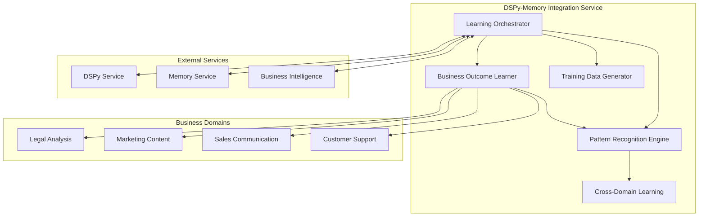

# DSPy-Memory Integration Service

An autonomous learning system that connects DSPy optimization with Memory service and Business Intelligence services to enable continuous learning and optimization based on real business outcomes.

## Overview

This service creates a comprehensive feedback loop where business success directly drives AI improvement. It orchestrates learning activities across multiple domains, discovers successful patterns, and automatically optimizes DSPy prompts based on real-world business results.

## Key Features

### 🧠 Autonomous Learning System
- **Business Outcome Learning**: Learns from revenue, customer satisfaction, and operational metrics
- **Pattern Recognition**: Automatically discovers successful patterns in business outcomes
- **Continuous Optimization**: Runs ongoing optimization jobs to improve AI performance
- **Cross-Domain Transfer**: Applies successful patterns across different business domains

### 📊 Comprehensive Analytics
- **Performance Tracking**: Monitors success rates, confidence levels, and business impact
- **Trend Analysis**: Identifies improving, declining, or stable performance patterns
- **Cost-Benefit Analysis**: Tracks ROI of AI optimization efforts
- **Predictive Insights**: Projects future performance based on current trends

### 🔄 Integration Architecture
- **DSPy Service Integration**: Seamless prompt optimization and deployment
- **Memory Service Integration**: Persistent storage of learning patterns and outcomes
- **Business Intelligence Integration**: Real-time business metrics and reporting
- **Multi-Service Orchestration**: Coordinates learning activities across services

### 🎯 Domain-Specific Learning
- **Legal Analysis**: Optimizes for accuracy and compliance requirements
- **Marketing Content**: Learns from engagement and conversion metrics
- **Sales Communication**: Improves based on deal closure and response rates
- **Customer Support**: Enhances satisfaction scores and resolution times

## Architecture



## API Endpoints

### Learning Management
- `POST /api/learning/jobs` - Create new learning job
- `GET /api/learning/jobs` - List learning jobs with filtering
- `GET /api/learning/jobs/:jobId` - Get job details
- `PATCH /api/learning/jobs/:jobId/pause` - Pause learning job
- `PATCH /api/learning/jobs/:jobId/resume` - Resume learning job
- `DELETE /api/learning/jobs/:jobId` - Cancel learning job

### Business Outcomes
- `POST /api/outcomes` - Record business outcome
- `POST /api/outcomes/batch` - Batch record outcomes
- `GET /api/outcomes` - Query outcomes with filtering
- `GET /api/outcomes/:outcomeId` - Get outcome details
- `GET /api/outcomes/analytics/:domain` - Domain analytics

### Pattern Management
- `POST /api/patterns/discover` - Discover patterns from outcomes
- `GET /api/patterns/domain/:domain` - Get domain patterns
- `GET /api/patterns/:patternId` - Get pattern details
- `PATCH /api/patterns/:patternId` - Update pattern
- `POST /api/patterns/:patternId/validate` - Validate pattern
- `GET /api/patterns/:patternId/analytics` - Pattern analytics

### Real-time Updates
- `WebSocket /ws/learning-progress` - Real-time learning progress
- `WebSocket /ws/optimization-status` - Optimization job status
- `WebSocket /ws/pattern-updates` - Pattern discovery notifications

## Configuration

### Environment Variables

```bash
# Service Configuration
PORT=8015
NODE_ENV=production

# Redis Configuration (for job queues)
REDIS_HOST=localhost
REDIS_PORT=6379
REDIS_PASSWORD=your_redis_password
REDIS_DB=0

# Service Integrations
DSPY_SERVICE_URL=http://localhost:8006
MEMORY_SERVICE_URL=http://localhost:3001
BUSINESS_INTELLIGENCE_URL=http://localhost:8013

# Learning Parameters
CONTINUOUS_LEARNING_ENABLED=true
BATCH_LEARNING_INTERVAL="0 */5 * * * *"
EMERGENCY_OPTIMIZATION_THRESHOLD=0.3
MAX_CONCURRENT_JOBS=5
DEFAULT_LEARNING_RATE=0.1
SAFETY_THRESHOLD=0.8

# Optimization Parameters
DEFAULT_MAX_ITERATIONS=100
CONVERGENCE_THRESHOLD=0.01
EXPLORATION_RATE=0.1
ROLLBACK_THRESHOLD=0.2
```

## Development

### Prerequisites
- Node.js 20+
- Redis (for job queues)
- Access to DSPy, Memory, and Business Intelligence services

### Setup
```bash
# Install dependencies
npm install

# Start development server
npm run dev

# Run tests
npm run test

# Build for production
npm run build
```

### Docker Development
```bash
# Build Docker image
docker build -t dspy-memory-integration .

# Run with Docker Compose
docker-compose up -d
```

## Usage Examples

### Recording Business Outcomes

```typescript
// Record a successful legal analysis outcome
const outcome = await fetch('/api/outcomes', {
  method: 'POST',
  headers: { 'Content-Type': 'application/json' },
  body: JSON.stringify({
    promptId: 'legal_analysis_prompt_123',
    domain: 'legal_analysis',
    success: true,
    confidence: 0.92,
    metrics: {
      performance: {
        accuracy: 0.95,
        responseTime: 1200
      },
      satisfaction: {
        score: 9
      },
      cost: {
        computeCost: 0.05,
        humanIntervention: false
      }
    },
    context: {
      documentType: 'terms_of_service',
      jurisdiction: 'US',
      customerSegment: 'enterprise',
      timeOfDay: 'afternoon'
    }
  })
});
```

### Creating Learning Jobs

```typescript
// Create continuous learning job for marketing domain
const learningJob = await fetch('/api/learning/jobs', {
  method: 'POST',
  headers: { 'Content-Type': 'application/json' },
  body: JSON.stringify({
    domain: 'marketing_content',
    type: 'continuous',
    parameters: {
      targetMetrics: ['engagement.clickThroughRate', 'engagement.conversionRate'],
      priority: 8,
      constraints: {
        maxIterations: 150,
        safetyThreshold: 0.85
      }
    },
    triggerEvent: 'low_engagement_detected'
  })
});
```

### Discovering Patterns

```typescript
// Discover patterns in customer support outcomes
const patterns = await fetch('/api/patterns/discover', {
  method: 'POST',
  headers: { 'Content-Type': 'application/json' },
  body: JSON.stringify({
    domain: 'customer_support',
    minSampleSize: 100,
    minConfidence: 0.8,
    timeWindow: {
      start: '2024-01-01T00:00:00Z',
      end: '2024-01-31T23:59:59Z'
    },
    contextFilters: {
      customerTier: 'premium'
    }
  })
});
```

## Monitoring and Observability

### Health Checks
- `/health` - Service health status
- `/api/learning/health` - Integration health status
- `/api/learning/metrics` - System performance metrics

### Logging
- Structured JSON logs with correlation IDs
- Performance tracking for all operations
- Error tracking with stack traces
- Business outcome audit trail

### Metrics
- Learning job success/failure rates
- Pattern discovery effectiveness
- Business outcome correlation scores
- System resource utilization
- Integration latency and availability

## Security

### Authentication
- JWT-based authentication for API access
- Service-to-service authentication with API keys
- Role-based access control for sensitive operations

### Data Protection
- Encryption at rest for sensitive business data
- TLS encryption for all network communication
- Audit logging for compliance requirements
- Data retention policies for GDPR compliance

## Performance

### Optimization Features
- Asynchronous job processing with BullMQ
- Connection pooling for database operations
- Caching of frequently accessed patterns
- Batch processing for bulk operations

### Scalability
- Horizontal scaling with Redis job queues
- Stateless service design for containerization
- Resource limits and timeout handling
- Graceful degradation under load

## Contributing

1. Fork the repository
2. Create a feature branch
3. Implement changes with tests
4. Submit pull request with detailed description

## License

Proprietary - Fine Print AI Platform