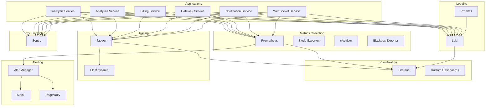

# Fine Print AI Production Monitoring Stack

## Overview

This is a comprehensive, production-ready monitoring infrastructure for Fine Print AI that provides complete observability across all microservices. The stack includes metrics collection, log aggregation, distributed tracing, error tracking, and intelligent alerting.

## Architecture



## Services

### Core Monitoring Services

| Service | Purpose | Port | URL |
|---------|---------|------|-----|
| **Prometheus** | Metrics collection and alerting | 9090 | http://localhost:9090 |
| **Grafana** | Dashboards and visualization | 3000 | http://localhost:3000 |
| **Loki** | Log aggregation | 3100 | http://localhost:3100 |
| **Jaeger Query** | Distributed tracing UI | 16686 | http://localhost:16686 |
| **AlertManager** | Alert routing and notifications | 9093 | http://localhost:9093 |

### Supporting Services

| Service | Purpose | Port |
|---------|---------|------|
| **Promtail** | Log shipping to Loki | 9080 |
| **Jaeger Collector** | Trace collection | 14268 |
| **Elasticsearch** | Jaeger trace storage | 9200 |
| **Node Exporter** | System metrics | 9100 |
| **cAdvisor** | Container metrics | 8080 |
| **Blackbox Exporter** | Endpoint monitoring | 9115 |

## Quick Start

### Prerequisites

- Docker & Docker Compose
- Kubernetes cluster (optional)
- Python 3.8+ (for health checks)

### 1. Automated Setup

```bash
# Clone the repository and navigate to monitoring directory
cd infrastructure/monitoring

# Run the automated setup script
./scripts/setup-monitoring.sh setup
```

### 2. Manual Docker Compose Setup

```bash
# Create data directories
mkdir -p data/{prometheus,grafana,loki,jaeger,alertmanager,elasticsearch}

# Set permissions
sudo chown -R 65534:65534 data/prometheus
sudo chown -R 472:472 data/grafana
sudo chown -R 10001:10001 data/loki

# Copy environment file and update with your API keys
cp .env.example .env
# Edit .env with your configuration

# Start the monitoring stack
docker-compose up -d

# Verify health
python3 healthchecks/monitoring-healthcheck.py
```

### 3. Kubernetes Deployment

```bash
# Create namespace and RBAC
kubectl apply -f k8s/namespace.yaml
kubectl apply -f k8s/rbac.yaml

# Create secrets (update with your values)
kubectl create secret generic grafana-secrets \
  --from-literal=admin-password=your-password \
  --namespace=fineprintai-monitoring

# Deploy monitoring services
kubectl apply -f k8s/prometheus-deployment.yaml
kubectl apply -f k8s/grafana-deployment.yaml

# Verify deployment
kubectl get pods -n fineprintai-monitoring
```

## Configuration

### Environment Variables

Key configuration in `.env` file:

```bash
# Grafana Authentication
GRAFANA_ADMIN_PASSWORD=secure-password
GOOGLE_CLIENT_ID=your-google-oauth-client-id
GOOGLE_CLIENT_SECRET=your-google-oauth-secret

# Notification Channels
SLACK_API_URL=your-slack-webhook-url
SENDGRID_API_KEY=your-sendgrid-api-key
PAGERDUTY_INTEGRATION_KEY=your-pagerduty-key

# External Services
SENTRY_SECRET_KEY=your-sentry-secret-key
```

### Service Configuration Files

| Component | Configuration File | Purpose |
|-----------|-------------------|---------|
| Prometheus | `prometheus/prometheus.yml` | Scrape targets and rules |
| Grafana | `grafana/provisioning/` | Datasources and dashboards |
| Loki | `loki/loki.yml` | Log ingestion and storage |
| AlertManager | `alertmanager/alertmanager.yml` | Alert routing rules |
| Jaeger | `jaeger/jaeger-*.yml` | Trace collection and storage |

## Dashboards

### Pre-built Dashboards

1. **Analysis Service Dashboard** - Document processing metrics, AI model performance
2. **Gateway Service Dashboard** - API metrics, rate limiting, authentication
3. **Business Metrics Dashboard** - KPIs, revenue metrics, user engagement
4. **Infrastructure Overview** - System health, resource utilization
5. **Security Dashboard** - Failed logins, rate limit violations, suspicious activity

### Custom Dashboard Development

```bash
# Add custom dashboards
cp your-dashboard.json grafana/dashboards/

# Dashboard will be automatically provisioned
```

## Alerting

### Alert Categories

| Severity | Response Time | Examples |
|----------|---------------|----------|
| **Critical** | 5 minutes | Service down, payment failures, security breaches |
| **Warning** | 15 minutes | High response times, low cache hit rates |
| **Info** | 1 hour | Deployment notifications, capacity warnings |

### Notification Channels

- **Slack**: Real-time alerts to team channels
- **PagerDuty**: Critical alerts with escalation
- **Email**: Summary reports and non-urgent alerts

### Alert Rules

Key alerts configured:

```yaml
# Service Health
- ServiceDown: Any microservice stops responding
- HighErrorRate: API error rate > 5%
- ResponseTimeHigh: P95 response time > 5s

# Business Metrics
- PaymentProcessingFailure: Payment success rate < 95%
- SubscriptionChurnHigh: Monthly churn > 10%

# Security
- HighFailedLoginAttempts: Failed auth rate > 20%
- RateLimitViolationSpike: Rate limit violations > 1000/hour

# Infrastructure
- HighMemoryUsage: Available memory < 10%
- DiskSpaceLow: Disk usage > 85%
```

## Log Aggregation

### Log Sources

- Application logs from all Fine Print AI services
- NGINX access and error logs
- Kubernetes pod logs
- System logs (syslog)

### Log Structure

Structured JSON logging with fields:
- `timestamp`: ISO 8601 timestamp
- `level`: Log level (error, warn, info, debug)
- `service`: Service name
- `user_id`: User identifier (when available)
- `request_id`: Request correlation ID
- `message`: Log message

### Log Queries

Common Loki queries:

```logql
# Error logs across all services
{job=~".*-service"} |= "level=error"

# User-specific logs
{job="analysis-service"} |= "user_id=12345"

# High-frequency errors
sum by (service) (rate({job=~".*-service"} |= "error" [5m]))
```

## Distributed Tracing

### Trace Collection

- **OTLP**: OpenTelemetry Protocol support
- **Jaeger**: Native Jaeger protocol
- **Zipkin**: Zipkin protocol compatibility

### Sampling Strategy

- **Analysis Service**: 50% sampling (high value traces)
- **Billing Service**: 100% sampling (critical transactions)
- **Gateway Service**: 10% sampling (high volume)
- **WebSocket Service**: 1% sampling (very high volume)

### Trace Analysis

Key metrics tracked:
- Request latency across services
- Database query performance
- External API call duration
- Error propagation paths

## Security

### Authentication

- **Grafana**: Google OAuth + local accounts
- **Prometheus**: IP-based access control
- **Jaeger**: Network-level security

### Data Privacy

- No sensitive data stored in metrics
- Log scrubbing for PII
- Encrypted communication (TLS)
- Access logging and audit trails

### Network Security

- Internal service communication
- Firewall rules for external access
- VPN requirements for production access

## Monitoring Best Practices

### Service Integration

Add to your Fine Print AI services:

```javascript
// Prometheus metrics
const promClient = require('prom-client');
const register = promClient.register;

// Custom business metrics
const documentsProcessed = new promClient.Counter({
  name: 'fineprintai_documents_processed_total',
  help: 'Total documents processed',
  labelNames: ['service', 'document_type', 'status']
});

// HTTP request metrics
const httpRequestDuration = new promClient.Histogram({
  name: 'fineprintai_http_request_duration_seconds',
  help: 'HTTP request duration',
  labelNames: ['method', 'route', 'status_code']
});

// Jaeger tracing
const { initTracer } = require('jaeger-client');
const tracer = initTracer(config, options);

// Structured logging
const logger = require('pino')({
  level: 'info',
  formatters: {
    level: (label) => ({ level: label })
  }
});
```

### Metric Naming

Follow consistent naming conventions:
- `fineprintai_<component>_<metric>_<unit>`
- Use labels for dimensions
- Include help descriptions

### Dashboard Design

- **Golden Signals**: Latency, traffic, errors, saturation
- **Business Metrics**: Revenue, user engagement, feature usage
- **SLI/SLO Tracking**: Service level indicators and objectives

## Troubleshooting

### Common Issues

#### Services Not Starting

```bash
# Check Docker logs
docker-compose logs prometheus

# Check Kubernetes events
kubectl get events -n fineprintai-monitoring

# Verify configuration
./scripts/setup-monitoring.sh health-check
```

#### Missing Metrics

```bash
# Check Prometheus targets
curl http://localhost:9090/api/v1/targets

# Verify service annotations
kubectl get pods -o yaml | grep prometheus.io
```

#### Dashboard Not Loading

```bash
# Check Grafana logs
docker-compose logs grafana

# Verify datasource connectivity
curl http://localhost:3000/api/datasources
```

### Health Checks

Run comprehensive health checks:

```bash
# Basic health check
python3 healthchecks/monitoring-healthcheck.py

# Detailed output
python3 healthchecks/monitoring-healthcheck.py --output json

# Quiet mode (for scripts)
python3 healthchecks/monitoring-healthcheck.py --quiet
```

### Runbooks

Detailed runbooks available in `runbooks/`:
- [Service Down](runbooks/service-down.md)
- [High Error Rate](runbooks/high-error-rate.md)
- [Database Issues](runbooks/database-issues.md)
- [Memory Pressure](runbooks/memory-pressure.md)

## Maintenance

### Data Retention

| Component | Retention | Storage |
|-----------|-----------|---------|
| Prometheus | 30 days | 50GB |
| Loki | 30 days | 25GB |
| Jaeger | 7 days | 20GB |
| Grafana | Indefinite | 10GB |

### Backup Strategy

```bash
# Backup Grafana dashboards
docker exec grafana grafana-cli admin export-dashboard

# Backup Prometheus data
docker cp prometheus_container:/prometheus ./prometheus-backup

# Backup configuration
tar -czf monitoring-config-backup.tar.gz prometheus/ grafana/ loki/ jaeger/
```

### Updates

```bash
# Update images
docker-compose pull
docker-compose up -d

# Update Kubernetes deployments
kubectl set image deployment/prometheus prometheus=prom/prometheus:v2.46.0 -n fineprintai-monitoring
```

## Performance Tuning

### Resource Requirements

| Service | CPU | Memory | Storage |
|---------|-----|--------|---------|
| Prometheus | 2 cores | 4GB | 100GB |
| Grafana | 0.5 cores | 1GB | 10GB |
| Loki | 1 core | 2GB | 50GB |
| Jaeger | 1 core | 2GB | 20GB |
| Elasticsearch | 2 cores | 4GB | 100GB |

### Scaling

- **Horizontal**: Multiple Prometheus instances with federation
- **Vertical**: Increase resources based on metrics volume
- **Storage**: Use fast SSD storage for better performance

## Support

### Team Contacts

- **Platform Team**: platform-team@fineprintai.com
- **On-Call**: Use PagerDuty escalation
- **Documentation**: https://docs.fineprintai.com/monitoring

### Getting Help

1. Check the runbooks for common issues
2. Run health checks to identify problems
3. Review service logs for error details
4. Contact the platform team with findings

### Contributing

1. Add new dashboards to `grafana/dashboards/`
2. Update alert rules in `prometheus/alerts/`
3. Extend health checks in `healthchecks/`
4. Document changes in runbooks

---

*This monitoring stack provides enterprise-grade observability for Fine Print AI's production workloads. For questions or improvements, reach out to the platform team.*